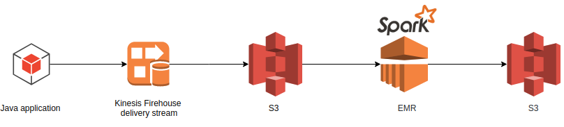

# Loan Data Report with AWS

## Architecture Design Schema


+ Java application writes data to Kinesis Firehouse(loan_firehouse_stream)
+ Kinesis Firehouse puts data to S3 bucket(s3-loan-stream)
+ EMR creates a Hadoop cluster and runs Spark application
+ Spark application creates two reports and saves to S3 bucket.


## Local Development Environment and Configurations
```console
$ lsb_release -a | grep Description
Description:	Ubuntu 18.04.3 LTS
```

```console
$ java -version
openjdk version "1.8.0_242"
OpenJDK Runtime Environment (build 1.8.0_242-8u242-b08-0ubuntu3~18.04-b08)
OpenJDK 64-Bit Server VM (build 25.242-b08, mixed mode)
```
Sbt installed for Scala development.
```console
$ sudo apt update
$ sudo apt install sbt
```

AWS CLI version 2 installed.
```
$ curl "https://awscli.amazonaws.com/awscli-exe-linux-x86_64.zip" -o "awscliv2.zip"
$ unzip awscliv2.zip
$ sudo ./aws/install
```
AWS Identity and Access Management (IAM) user, role and group created for authentication and authorization, then IAM user credentials saved in local. S3 bucket created.
```console
$ mkdir ~/.aws/
$ vim ~/.aws/credentials

[default]
aws_access_key_id = <access key id>
aws_secret_access_key = <secret key>

$ aws s3 mb s3://s3-loan-stream --region eu-central-1
```
## Kinesis Firehouse Java SDK API

### Initial Java Project

```
$ sudo apt install maven
$ mvn archetype:generate \
-DgroupId=com.putloanfile.putS3 \
-DartifactId=java-firehouse-loan \
-DarchetypeArtifactId=maven-archetype-quickstart \
-DinteractiveMode=false
```

Test directory is removed and pom.xml updated like aws-java-sample and dependencies installed by maven package.

```
$ mvn package
```


### Initial Scala Project

Scala-spark-loan directories created manually, project compiled and sent to S3 as below. 
```console 
$ tree scala-spark-loan/
src
├── main
│   └── scala
│       └── process_csv.scala
└── process_csv.sbt

$ sbt package
$ aws s3 cp scala_loan_2.11-{version}.jar s3://s3-loan-stream/
```
**Running the project**
_After pulling project to local, compile applications as below._

```
$ cd java-firehouse-loan
$ mvn clean compile exec:java

$ cd scala-spark-loan
$ sbt package
```


## Kinesis Firehose delivery streams 
+ On Amazon Kinesis page when logged into AWS account
+ Kinesis Data Firehose delivery stream created
  - Source: Direct PUT or other sources
  - stream: loan_firehouse_stream
+ Destination set as S3 to store data
  - bucket: s3-loan-stream
  
 
## Spark Application on Amazon EMR
+ On Amazon EMR page when logged into AWS account
+ Create cluster
  - Software configuration
    * Release emr-5.29.0, Hadoop 2.8.5, Spark 2.4.4
  - Steps
    * Cluster auto-terminates after last step
    * Deploy mode cluster
    * Number of executors: 3, # of instances
    * Number of cores: 4, # of vCore in instance
    * Number of shuffle partitions: 24
  - Hardware configuration
    * 1 Master, 4 Core(Worker) instances
    * Instances: m4.large, 4 vCore, 8 GiB memory
 
Spark submit command
```
spark-submit --deploy-mode cluster --master yarn --class loan_example --num-executors=3 --executor-cores=4 --conf spark.sql.shuffle.partitions=24 s3://s3-loan-stream/scala_loan_2.11-1.3.jar
```

## Additional Information
In this case, raw data file is around 440 MB. Overpartitioning puts a load on small data and increases processing time. Number of partitions up to 2-3 times the total CPU number is sufficient for this case. The Hadoop cluster above can easily handle the data with configured partitions.
Coalesce, persist, unpersist methods provide noticeable benefits when processing larger data in Spark application.
  
## Sources

+ [What Is Amazon Kinesis Data Firehose?](https://docs.aws.amazon.com/firehose/latest/dev/what-is-this-service.html)

+ [Amazon Kinesis Data Firehose FAQs](https://aws.amazon.com/tr/kinesis/data-firehose/faqs/)

+ [AWS SDK for Java Sample Project](https://github.com/awslabs/aws-java-sample.git)


